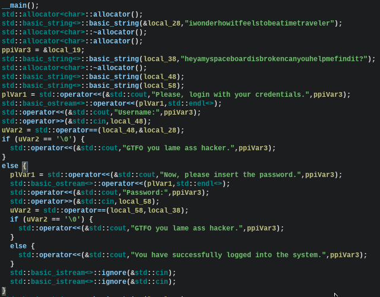

---
# 1. Tightening fundamentals:

## Assembly(reading):

#### General Purpose Registers:
	-AX : storage for arithmetic operations
	-CX: shift/rotate and loops instructions to keep track of cycles
	-DX: arithmetic and I/O operations but also general storage
	-BX: pointer to data located in segment registers
	-SP: pointer to the top of the stack. The address held by SP
		is the RAM address where the last byte was stored

These registers are 16-bit

32-bit  -> prefix names with E
64-bit  -> prefix names with R 

#### Segment Registers:
	-SS: Pointer to stack
	-CS: pointer to code
	-DS: pointer to data
	-ES: extra data
	-FS: extra data
	-GS: extra data

#### Instructions:

```
00D284A2 MOV RAX, 1          ;Comments here
```

#### Assembler Directives:

They begin with a period ".". Usually an .asm file would contain at least:
1. Data section, initialized variables/constants
2. BSS section, uninitialized data
3. Text section, program body

#### Program Structure:

```
section .text
global _start
_start:
	mov ecx, myStr
	mov edx, myStrLen
	mov ebx, 1
	mov eax, 4
	int 0x80
section .data
myStr db 'Works!', 0xa
myStrLen equ $ - myStr
```

Initialized Variables:
	equ : used to define constants
	dd : define data
	db : define bytes
	dq: define 64 bit
Uninitialized Variables:
	resb : reserve 1 byte array
	resw : reserve 2 bytes array
	resd : reserve 4 bytes array
	resq : reserve 10 bytes array
usage:

```
array1 resb 5                ;5 elements byte array
```

#### Moving Data:

```
mov <dest>, <source>
```

Get Value -> mov rax, qword[var1]
Get Address -> mov rax, var1

#### Integer arithmetic:

```
add <dest>, <source>
```

1. dest and source must be of the same size
2. final result is stored into dest
3. dest must be able to store values (cannot do add 1, reg)
4. both operands cannot be in memory 

```
inc <operand>
```

1. the type must be specified (inc byte[var])

```
sub <dest>, <src>
```

1. src and dest have to be the same size
2. both operands cannot be in memory
3. destination cannot be a number

```
dec <operand>
```

1. the type must be specified (inc byte[var])

```
mul <operand>   ;result is stored in eax and edx if needed for overflow
```

1. if operand is in AL lower bits : AL upper bits : AH
2. if operand is in AX lower bits : AX upper bits : DX
3. if operand is in EAX lower bits : EAX upper bits in EDX
4. if operand is in RAX lower bots : RAX upper bits in RDX


# Practice(static exercices):

##  sudo0x18's Level1 
  
**Link:** [https://crackmes.one/crackme/686c08dbaadb6eeafb3990bb](https://crackmes.one/crackme/686c08dbaadb6eeafb3990bb)  
**Difficulty:** Easy  
**Platform:** Unix/Linux  
**Tools Used:** IDA, strings  

---

## 1. Objective

find the password.

---

## 2. Initial Observations / Triage

- File type: ELF X86-64
- Observed strings: "What is the Secret ?"  ,  "checkPass"

---

## 3. Static Analysis

- Found `checkPass` in IDA
- Input argument compared against hardcoded string using `cmp` instruction 
- No complex loops or encryption detected  

---

## 4. Reverse Engineering Steps

- Decompiled CheckPass function shows a multiple `cmp` instructions comparing user input with  "sudo0x18"  
- Condition: if equal → success; else → fail  

---

## 5. Solution / Key Found

sudo0x18

# whitecr0w's Easy Peasy


**Link:** https://crackmes.one/crackme/5d295dde33c5d410dc4d0d05
**Difficulty:** Beginner / Intermediate  
**Platform:** Windows / Linux (specify)  
**Tools Used:** Ghidra

---

## 1. Objective
Brief description of the challenge.

> Find the correct Username and Password

---

## 2. Initial Observations / Triage

>- File type: PE x86-64 executable  
>-  Observed strings: "iwonderhowitfeelstobeatimetraveler, "heyamyspaceboardisbrokencanyouhelpmefindit?"


---

## 3. Static Analysis

> Example:
- Found string comparison inside main function and a lot of if-else statements:
 


---

## 5. Solution / Key Found

Username : iwonderhowitfeelstobeatimetraveler
Password : heyamyspaceboardisbrokencanyouhelpmefindit?
